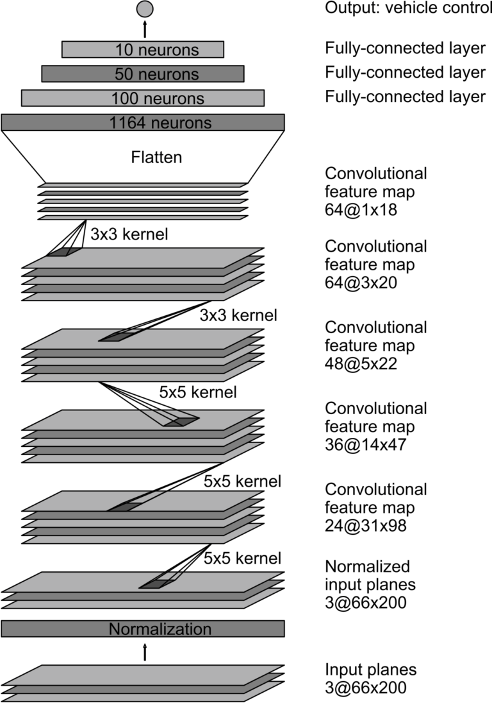
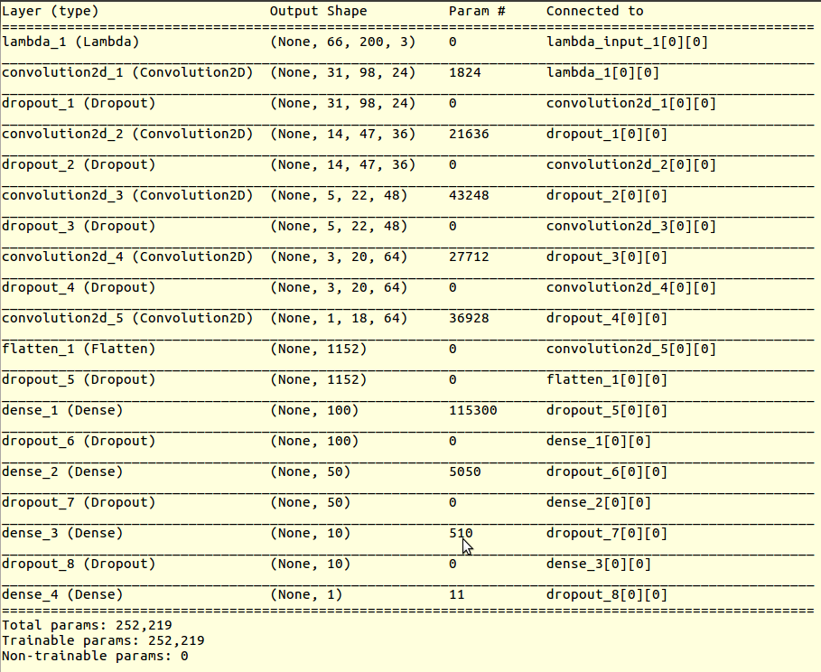
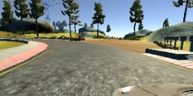
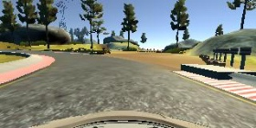
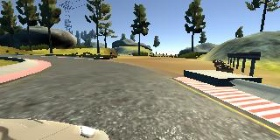
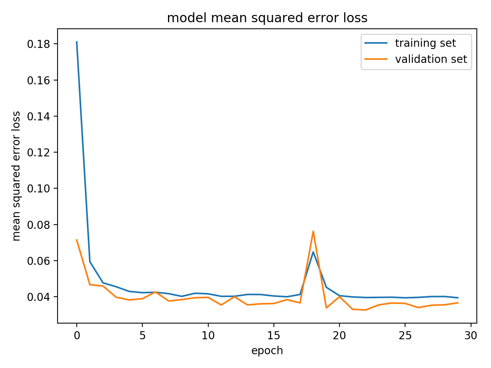

#**Behavioral Cloning**


**Behavioral Cloning Project**


The goals / steps of this project are the following:

* Use the simulator to collect data of good driving behavior
* Build, a convolution neural network in Keras that predicts steering angles from images
* Train and validate the model with a training and validation set
* Test that the model successfully drives around track one without leaving the road
* Summarize the results with a written report


---
###Files Submitted & Code Quality

####1. Submission includes all required files and can be used to run the simulator in autonomous mode

My project includes the following files:

* model.py containing the script to create and train the model
* drive.py for driving the car in autonomous mode
* model.h5 containing a trained convolution neural network 
* writeup_Luman.md summarizing the results

####2. Submission includes functional code
Using the Udacity provided simulator and my drive.py file, the car can be driven autonomously around the track by executing 
```sh
python drive.py model.h5
```

####3. Submission code is usable and readable

The model.py file contains the code for training and saving the convolution neural network. The file shows the pipeline I used for training and validating the model, and it contains comments to explain how the code works.

###Model Architecture and Training Strategy

####1. An appropriate model architecture has been employed

My model used [Nvidia's architecture](http://images.nvidia.com/content/tegra/automotive/images/2016/solutions/pdf/end-to-end-dl-using-px.pdf). This architecture proves to be highly efficient and successful in self-driving car tasks. Figure belows shows the network architecture, which consists of 9 layers, including a normalization layer, 5 convolutional layers, and 3 fully connected layers. 

<center> </center>

####2. Attempts to reduce overfitting in the model

The model contained dropout layers in order to reduce possible overfitting. In addition to dropout layers, l2 regularizations were also added.

The model was trained and validated on different data sets to ensure that the model was not overfitting. The model was tested by running it through the simulator and ensuring that the vehicle could stay on the track.

The complete model architecture was printed out using the `model.summary()` function, as shown in the figure below. Note that the model has a total of 252,219 trainable parameters. 

<center></center>

####3. Data Collection, Augmentation and Preprocessing

Training data from the driving simulator was collected. Each frame consisted of images from left, center and right cameras, as shown below:

<center>  </center>

Using three cameras and adding offset corrections to the left and right steering angles were helpful, as the car could be better trained to maintain in the center of the track.

To improve the performance and increase the generality of the model, the images were augmented and processed by

1. Randomly adjust the brightness, to account for various brightness levels the car might see in other tracks.

2. Add the flipped image and steering angle for each image, to reduce the possible bias of left turns vs right turns.

3. Crop off the top 40 pixels and bottom 20 pixels, to reduce the noise off track.

 4. Resize the image to feed in to the neural network pipeline.


####4. Training

The model used an adam optimizer, so the learning rate was not tuned manually. The model was trained with following parameters:

* Epochs = 30
* Samples per Epoch = 24000
* Batch Size = 64
* Train/Validation ratio = 85:15
* Angle correction for left/right cameras = 0.25

A plot of training/validation error vs epoch number was shown below

<center></center>

It showed that the model converged after about 15 epochs and was not overfitting up to 30 epochs, confirming the choice of hyper parameters was good.

####5. Results

The model was able to successfully drive the car around track 1 in the simulator. Note that there were some small wobbles at the very beginning of the course. Despite these wobbles, the car was able to maintain smoothly on the track. Please check the run1.mp4 in the repo for a full lap in track 1.


